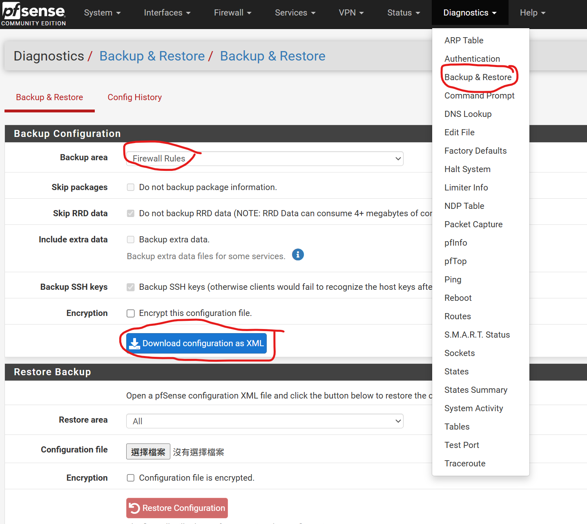

# pfSense Floating Rule Extrator and Merger
## Motivaton
pfSense only provide exporter for the whole firewall rules. But we only want to backup only the floating rules. Thus, I develope this extrator for extracting floating rule from the xml file that is exported by pfSense. 

I also develope Merger, that can help you to merge floating_rules.xml  and flaoting_seperators.xml produced by extrator back into firewall-config.xml.

## How to use extrator
1. Download the backup.xml from your pfSense: `Diagnostics` > `Backup&Restore` > select `Backup` area as `Firewall Rules` > download it


2. `python3 extract_floating.py <input_config.xml>`
If everything goes well, it well display:
```
✔ Output saved in: pfsense_extract_<current datetime>
  ├─ floating_rules.xml
  └─ floating_separators.xml
```

## How to use merger
After you modify some firewall rule of some interfaces, you may want to use Merger to merge the `floating_rules.xml` and `floating_seperator.xml` that you backup before with current backup.xml file 

1. Download the current config.xml from your pfSense: `Diagnostics` > `Backup&Restore` > select `Backup` area as `Firewall Rules` > download it


2. `python merge_float.py <current_config.xml> <floating_rules.xml> <floating_separators.xml> <output.xml>`
If everything goes well, it well display:
```
✔ merge success! ouput file: output.xml
```